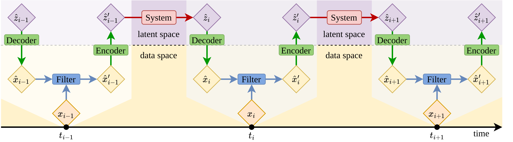

# LinODEnet — 𝗟𝗶𝗻ear 𝗢rdinary 𝗗ifferential 𝗘quation 𝗡𝗲𝘁work

[INSTALLATION](#installation) | [DOCUMENTATION](#documentation) | [CONTRIBUTING](CONTRIBUTING.md) | [CHANGELOG](CHANGELOG.md) | [LICENSE](LICENSE)



## Documentation

The documentation is hosted at <https://bvt-htbd.gitlab-pages.tu-berlin>.
de/kiwi/tf1/linodenet>. Alternatively, it can be built with Sphinx locally by
running `make html` in the `docs` directory.

## Installation

Install via pip:

```bash
pip install -e .
```
