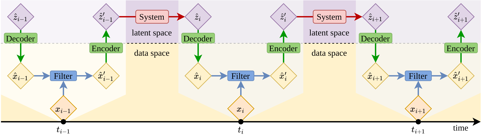

LinODEnet - 𝗟𝗶𝗻ear 𝗢rdinary 𝗗ifferential 𝗘quation 𝗡𝗲𝘁work
===========================================================

.. toctree::
   :titlesonly:
   :maxdepth: 2
   :name: mastertoc

   API <apidoc/modules>
   CHANGELOG <content/CHANGELOG>
   CONTRIBUTING <content/CONTRIBUTING>
   ISSUES <content/ISSUES>
   LICENSE <content/LICENSE>
   README <content/README>

Installation
============

Install the linodenet package using ``pip`` by

.. code-block:: bash

   pip install -e .

Here we assume that you want to install the package in editable mode, because
you would like to contribute to it. This package is not available on PyPI, it
might be in the future, though.

Example
=======

To ease the usage this package tries to follow the guidelines of scikit-learn
estimators
https://scikit-learn.org/stable/developers/develop.html. In practise the usage
looks like this:

.. code-block:: python

   import linodenet

   model = linodenet.model.LinearContraction

Contribute
==========

- Issue Tracker: https://git.tu-berlin.de/bvt-htbd/kiwi/tf1/linodenet/-/issues
- Source Code: https://git.tu-berlin.de/bvt-htbd/kiwi/tf1/linodenet

Support
=======

If you encounter issues, please let us know.

Indices and tables
==================

* :ref:`genindex`
* :ref:`modindex`
* :ref:`search`
